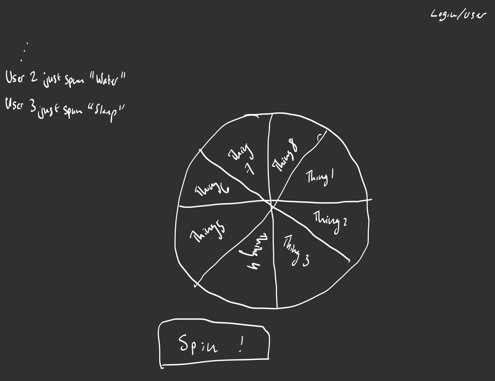
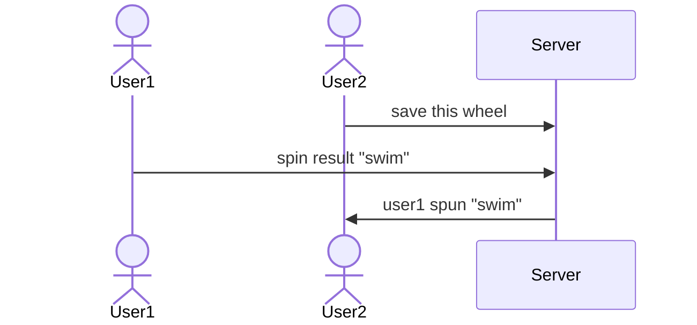

# Wheel Spinner - Random Choice Maker

[My Notes](notes.md)

> [!NOTE]
>  This is a template for your startup application. You must modify this `README.md` file for each phase of your development. You only need to fill in the section for each deliverable when that deliverable is submitted in Canvas. Without completing the section for a deliverable the TA will not know what to look for when grading your submission. Feel free to add additional information to each deliverable description, but make sure you at least have the list of rubric items and a description of what you did for each item.

## 🚀 Specification Deliverable

- [x] Proper use of Markdown in README.md
- [x] A concise and compelling elevator pitch in your README.md
- [x] Description of key features in your README.md
- [x] Description of how you will use each technology
- [x] One or more rough sketches of your application. Images must be embedded in your README.md.

### Elevator pitch

You know that moment when you need to decide between a list of options and they are all equally good? What you need is a simple website where you can create a spinner to make the choice for you. It is quick and simple, just fill in the blanks and add as many choices as you need. You can even save previous wheels if you often need to do similar spins. Plus you can see what others are spinning at the same time for fun!

### Design

Just a simple page where the central element is the spinning wheel, and you can put in all of the options.

### Key features

- Ability to login to have history of wheels
- Ability to adjust number of entries
- See results of other users spins

### Technologies

I am going to use the required technologies in the following ways.

- **HTML** - Organize main content on page, two primary pages: wheels and login.
- **CSS** - Style and keep text elements clear and visually separated. Also adjust for screen size.
- **React** - Control spinning animation, random result picking, login and authentication.
- **Service** - Endpoints for login, saving, and retrieving old wheels, change the colors of wheel using the [ColourLovers](https://www.colourlovers.com/api#palettes) for fun.
- **DB/Login** - Store users and wheels. Securely store users information. Cannot save wheels if not logged in.
- **WebSocket** - Serve results from other wheel spins to add a fun twist.

## 🚀 AWS deliverable

For this deliverable I did the following. I checked the box `[x]` and added a description for things I completed.

- [x] **Server deployed and accessible with custom domain name** - [My server link](https://ecdye.click).

## 🚀 HTML deliverable

For this deliverable I did the following. I checked the box `[x]` and added a description for things I completed.

- [x] **HTML pages** - 3 basic pages representing the webpage have been implemented
- [x] **Proper HTML element usage** - All the different elements are used in appropriate places
- [x] **Links** - There are links across all parts of the page
- [x] **Text** - Text elements are used throughout the pages
- [x] **3rd party API placeholder** - Placeholder in pages
- [x] **Images** - An image is included to show off the very simple origins of the page
- [x] **Login placeholder** - There is a placeholder login page
- [x] **DB data placeholder** - There is a placeholder history page that will use a database
- [x] **WebSocket placeholder** - There is a websocket placeholder that has results of other users spins

## 🚀 CSS deliverable

For this deliverable I did the following. I checked the box `[x]` and added a description for things I completed.

- [x] **Header, footer, and main content body** - General styling was added
- [x] **Navigation elements** - Sticky navbar with styling complete
- [x] **Responsive to window resizing** - The website appears normal in normal configurations.
- [x] **Application elements** - All of the different elements of the application are styled as much as possible without use of JS.
- [x] **Application text content** - Text is styled as appropriate to draw focus and encourage clarity
- [x] **Application images** - The image on the about page is styled to appear nicely

## 🚀 React part 1: Routing deliverable

For this deliverable I did the following. I checked the box `[x]` and added a description for things I completed.

- [x] **Bundled using Vite** - Everything gets all bundled up nicely
- [x] **Components** - I use components all throughout to simplify complexity
- [x] **Router** - Routing is set up between all the different pages

## 🚀 React part 2: Reactivity

For this deliverable I did the following. I checked the box `[x]` and added a description for things I completed.

- [x] **All functionality implemented or mocked out** - Everything is mocked out and working using local browser storage, or placeholders for service calls.
- [x] **Hooks** - There are hooks in place throughout that use the state or effect react functions.

See notes.md for more notes on what I've learned.

## 🚀 Service deliverable

For this deliverable I did the following. I checked the box `[x]` and added a description for things I completed.

- [x] **Node.js/Express HTTP service** - I use express in a custom service to serve up two primary API functions: the user/authorization abilities and the ability to save the previous wheels spun. Interestingly Safari doesn't like cookies from localhost but it works fine elsewhere.
- [x] **Static middleware for frontend** - My service in `service/index.js`, redirects to homepage if someone tries a path that is invalid
- [x] **Calls to third party endpoints** - I make a call to [The Color API](https://thecolorapi.com) to generate a palette from a semi-random input color and use that to set the colors for the whole wheel. It gets the initial color from the list of colors that I have defined in the first place.
- [x] **Backend service endpoints** - All the API endpoints that I expose are setup in `service/index.js`
- [x] **Frontend calls service endpoints** - My frontend uses my custom endpoints to properly track login/logout and save/serve history

## 🚀 DB/Login deliverable

For this deliverable I did the following. I checked the box `[x]` and added a description for things I completed.

- [x] **User registration** - User registration is now persistent because of MongoDB and it also properly hashes and securely stores passwords in the DB.
- [x] **User login and logout** - The user login/out works properly and remembers their data across login/logout. It also properly stores the user information so that you can't just login with the wrong password, as that used to be the case.
- [x] **Stores data in MongoDB** - Data is forwarded to the MongoDB database I have setup, it stores both the user login information (securely) and their associated wheel history for future reference when they save their choices. It was simple to migrate the local variable usage to be instead using MongoDB because of how simply it integrates with JSON, also because of how compartmented the design of the website is.
- [x] **Stores credentials in MongoDB** - All credentials are stored in the MongoDB database, local browser storage is only used for temporary storage of wheel configurations but no user data is actually stored locally.
- [x] **Restricts functionality based on authentication** - Functionality is properly limited now to only allow access to the history page if the user is logged in. If it is accessed without proper authentication it should ask the user to login to access the page.

## 🚀 WebSocket deliverable

For this deliverable I did the following. I checked the box `[x]` and added a description for things I completed.

- [ ] **Backend listens for WebSocket connection** - I did not complete this part of the deliverable.
- [ ] **Frontend makes WebSocket connection** - I did not complete this part of the deliverable.
- [ ] **Data sent over WebSocket connection** - I did not complete this part of the deliverable.
- [ ] **WebSocket data displayed** - I did not complete this part of the deliverable.
- [ ] **Application is fully functional** - I did not complete this part of the deliverable.
